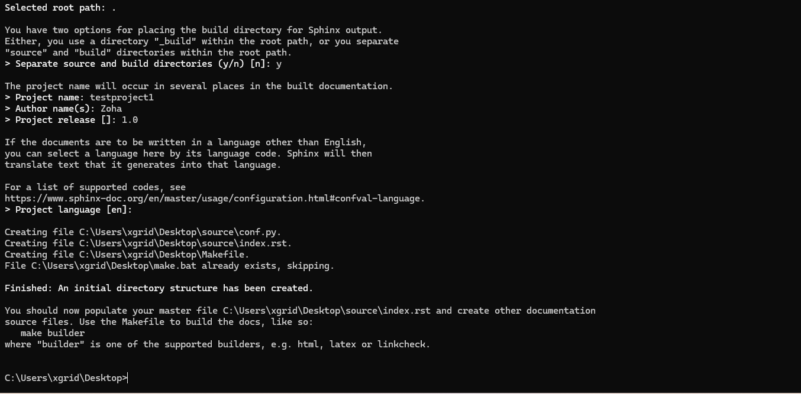

Building your first project
===========================

Once Sphinx is installed make use of the following commands to create project on sphinx:

1. Go to the command prompt. 
2. Open the required directory where you want to create the project.
3. To open a certain directory enter cd [folder/directory name]. 
 - Once the desired folder is accessed, enter sphinx-quickstart.
4. If the project is successfully building in background the following line appears, as shown in the image below, perform actions 

Step 1: Answer “>Separate source and build direction (y/n)[n]:” according to your requirement. 

Step 2: Fill the attributes as shown in the following table: 

Step 3: For “Project language” press enter for english or enter any other language of your preference. 

Step 4: Project is successfully built and project creation message appears on the terminal. 
